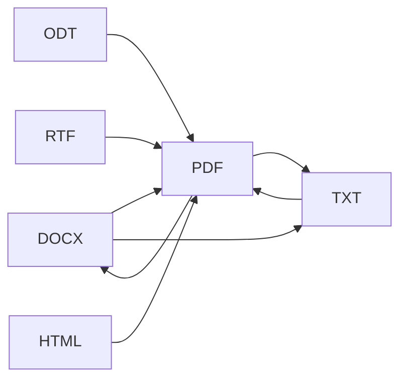

# Documents Module — Research & Architecture

> FormatX v1 · local-first document conversion  
> Related: [migration-to-react.md](./migration-to-react.md) · repo `src/features/images` (reference pattern)

## 1. Goals

| Principle | Meaning for FormatX |
|-----------|---------------------|
| **Local-only** | Files never leave the device (WebView2 / browser memory). No upload APIs. |
| **Same UX on all surfaces** | Web PWA, Tauri desktop, mobile PWA — one tab, one queue, one history model. |
| **Aligned with existing modules** | Reuse image pipeline patterns: queue → convert → download → SQL history (3-day TTL). |
| **Progressive weight** | Heavy engines (LibreOffice WASM ~240 MB) load lazily in a Worker, like `heic-to` today. |

## 2. Functional scope (v1)

Organize capabilities by **operation**, not by file extension first:

| Operation | User intent | Typical inputs | Typical outputs |
|-----------|-------------|----------------|-----------------|
| **Convert** | Change container/format | PDF, DOCX, ODT, RTF, TXT, HTML | PDF, DOCX, TXT, HTML |
| **To text** | Extract editable/plain text | PDF, DOCX | TXT, MD (optional) |
| **Merge** | Combine pages/files | PDF, images | PDF |
| **Split** | Extract page range | PDF | PDF (ZIP if many) |
| **Compress** | Reduce size (lossy/lossless) | PDF | PDF |
| **Sanitize metadata** | Strip author, dates | Office, PDF | Same format |

**Out of scope for v1 (later):** OCR (scanned PDF), digital signatures, collaborative editing, cloud sync (separate track).

## 3. Format & MIME matrix

Use a single registry (`documentFormats.ts`) — same idea as `MIME_MAP` in images.

### 3.1 Input formats (priority)

| Family | Extensions | MIME (common) | Notes |
|--------|------------|---------------|-------|
| PDF | `.pdf` | `application/pdf` | Merge/split/compress; text extract limited without OCR |
| Word | `.docx`, `.doc` | OOXML / legacy | DOC often needs LibreOffice WASM or Tauri sidecar |
| OpenDocument | `.odt` | `application/vnd.oasis.opendocument.text` | Good LO WASM support |
| Rich text | `.rtf` | `text/rtf` | Via LO WASM |
| Plain | `.txt`, `.md` | `text/plain`, `text/markdown` | Native / trivial |
| Web | `.html`, `.htm` | `text/html` | Export to PDF via LO WASM |
| Spreadsheet (v2?) | `.xlsx`, `.ods` | spreadsheet MIME | Same engine, different UI tab or sub-mode |
| Slides (v2?) | `.pptx`, `.odp` | presentation MIME | Same |

### 3.2 Output formats (v1)

| Output | Use case |
|--------|----------|
| **PDF** | Universal share, print |
| **DOCX** | Edit in Word |
| **TXT** | Pipelines, CMS, sanitizer handoff |
| **HTML** | Preview in app |
| **ODT** | Open-source editors |

### 3.3 Conversion graph (recommended v1 edges)



Start with **high-demand edges** (DOCX→PDF, PDF→TXT). Expand the graph only when the engine is loaded.

## 4. Engine options (local)

### 4.1 Comparison

| Engine | Runs in | Formats | Bundle size | License | Fit |
|--------|---------|---------|-------------|---------|-----|
| **@matbee/libreoffice-converter** | Browser Worker / Node | 15+ in/out | ~150–240 MB WASM (lazy) | Check repo license | **Best breadth** for PWA + Tauri webview |
| **mammoth** | Browser | DOCX → HTML/TXT | Small | MIT | DOCX text only, no PDF |
| **pdf-lib** | Browser | PDF create/edit/merge | Small | MIT | PDF structure, not DOCX→PDF |
| **pdf.js** | Browser | PDF render + text layer | Medium | Apache-2.0 | Preview + text extract |
| **docx** (npm) | Browser/Node | Generate DOCX | Small | MIT | Create DOCX, not convert from PDF |
| **Tauri + LibreOffice CLI** | Desktop only | Very wide | System install / bundled | GPL | Fallback when WASM too heavy |
| **Nutrient / PSPDFKit** | Browser | DOC→PDF, annotate | Commercial | Paid | Enterprise option |

### 4.2 Recommendation for FormatX

**Primary (all platforms):**

1. **LibreOffice WASM** (`@matbee/libreoffice-converter`) in a **dedicated Web Worker**  
   - One `DocumentConverterService` with `initialize()` / `convert(buffer, { from, to })` / `destroy()`  
   - Progress callbacks for UI (same as image queue)  
   - Download WASM only when user opens Documents tab first time  

**Secondary (lightweight, no WASM):**

2. **mammoth** — DOCX → HTML/TXT preview before full convert  
3. **pdf-lib** — merge/split/rotate pages on existing PDFs  
4. **pdf.js** — in-app PDF preview + copy text  

**Desktop-only escape hatch (optional):**

5. Tauri command that spawns `soffice --headless` if WASM fails or file > size limit — keep behind feature flag.

## 5. Code organization (vanilla → ready for React)

Mirror the **images** feature layout:

```
src/features/documents/
  types.ts              # DocumentQueueItem, ConversionJob, FormatId
  formatRegistry.ts     # extensions, MIME, allowed edges
  logic.ts              # pure: validate, pick engine, build output name
  converter/
    interface.ts          # DocumentConverter { canConvert, convert }
    libreofficeWasm.ts  # WASM adapter
    pdfLibAdapter.ts    # merge/split only
    mammothAdapter.ts   # docx preview
  worker/
    documentWorker.ts   # hosts heavy WASM off main thread
  view.ts               # (later: DocumentsView.tsx)
```

### 5.1 Core types (sketch)

```typescript
export type DocumentFormatId =
  | "pdf" | "docx" | "doc" | "odt" | "rtf" | "txt" | "html";

export interface ConversionRequest {
  id: string;
  file: File;
  inputFormat: DocumentFormatId;
  outputFormat: DocumentFormatId;
}

export interface ConversionResult {
  blob: Blob;
  mime: string;
  filename: string;
}
```

### 5.2 Pipeline (same mental model as images)

1. **Enqueue** — user drops files → validate against `formatRegistry`  
2. **Plan** — resolve converter adapter + output MIME  
3. **Run** — Worker executes (WASM); report progress  
4. **Persist** — `addHistoryItem({ type: "document", blobBase64, ... })` (extend schema)  
5. **Download** — reuse `lib/download.ts`  

### 5.3 Storage schema extension

Add to `history_items.type`: `"document"` (already generic string in SQL).

Optional columns (v1.1): `source_format`, `target_format`, `page_count`.

Keep **text sanitizer** on separate `text_snippets` table (unchanged).

## 6. Platform matrix

| Surface | Engine | Storage | Notes |
|---------|--------|---------|-------|
| **Web PWA** | LO WASM Worker + pdf-lib | sql.js | Disable SW for Tauri builds only; PWA may cache WASM after first load |
| **Tauri desktop** | Same WASM in WebView2 | SQLite plugin | `sql:allow-execute` required; large WASM ships in bundle or downloads on first use |
| **Mobile PWA** | Same, with memory limits | sql.js | Cap file size (e.g. 25 MB); warn on low RAM |

## 7. UX patterns (reuse from Photo tab)

- Drop zone + file list queue  
- Per-row: input name → output format select → status → download/remove  
- Batch: “Convert all” / ZIP of outputs (JSZip)  
- Engine loading banner: “Завантаження модуля конвертації (~240 MB), один раз…”  
- Error row: unsupported pair / file too large  

## 8. Implementation phases

| Phase | Deliverable |
|-------|-------------|
| **D0** | `formatRegistry` + UI placeholder wired to queue (no WASM) |
| **D1** | LO WASM Worker, DOCX/ODT/RTF → PDF |
| **D2** | PDF → TXT (pdf.js text layer or LO) |
| **D3** | pdf-lib merge/split; preview panel |
| **D4** | History in Account; TTL purge; i18n keys |
| **D5** | Desktop-only LO CLI fallback (optional) |

## 9. Security & privacy

- Process files in **Object URLs** revoked after job completes  
- No `fetch()` to third-party convert APIs  
- CSP: allow `wasm-unsafe-eval` only if required by engine (document in `tauri.conf.json`)  
- Clear Worker memory after `destroy()` on tab leave  

## 10. Testing strategy

| Layer | What to test |
|-------|----------------|
| `logic.ts` | Format detection, edge allowlist, filename output |
| Adapters | Mock Worker postMessage; golden files small fixtures in `fixtures/documents/` |
| E2E (manual) | 1 DOCX→PDF, 1 PDF→TXT on web + Tauri |

## 11. References

- LibreOffice WASM converter: https://github.com/matbeedotcom/libreoffice-document-converter  
- pdf-lib: https://pdf-lib.js.org  
- mammoth (DOCX→HTML): https://github.com/mwilliamson/mammoth.js  
- Mozilla pdf.js: https://mozilla.github.io/pdf.js  
- FormatX image module: `src/features/images/`  
- SQL schema: `migrations/001_init.sql`, `src/lib/storage/schema.ts`

---

*Last updated: 2026-05-27*
