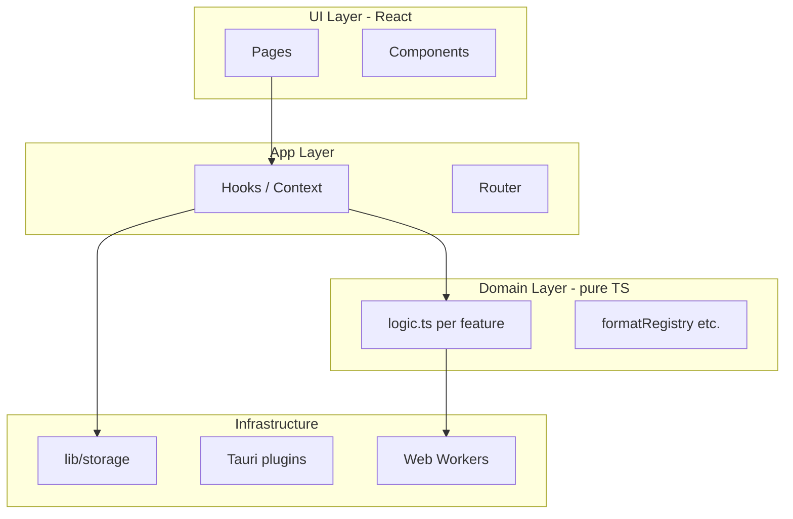

# Migration Guide: Vanilla TypeScript → React

> FormatX · incremental migration without stopping shipping  
> Companion: [documents-module-research.md](./documents-module-research.md)

## 1. Why migrate

| Current (vanilla) | Target (React) |
|-------------------|----------------|
| `innerHTML` + manual listeners in `view.ts` / `shell.ts` | Declarative UI, fewer listener leaks |
| String templates for i18n | `t()` in JSX with type-safe keys (optional) |
| Global router in `router.ts` | URL optional; state via Context + same persistence |
| Harder to test UI edge cases | React Testing Library for components |

**Do not big-bang rewrite.** Migrate **one vertical slice** at a time (Photo → Documents → Text → Shell).

## 2. Target stack

| Layer | Choice | Notes |
|-------|--------|-------|
| UI | **React 19** + **TypeScript** | Keep Vite |
| Routing | **React Router 7** (or keep custom router initially) | `/photo`, `/text`, `/documents`, `/account` |
| i18n | **react-i18next** | Reuse JSON in `src/locales/` |
| State (server/local) | **TanStack Query** (optional) for async storage | Or thin custom hooks |
| Styling | **Keep CSS modules or existing `app.css`** | No mandatory Tailwind |
| Desktop | **Tauri 2** unchanged | `@tauri-apps/api` from hooks |
| Tests | **Vitest** + **@testing-library/react** | Keep pure `logic.ts` tests as-is |

## 3. Target folder structure

```
src/
  app/
    App.tsx                 # providers, error boundary
    routes.tsx              # route → page mapping
    providers/
      I18nProvider.tsx
      ThemeProvider.tsx
      StorageProvider.tsx   # initStorage once
  components/               # shared UI
    Button/
    Field/
    TabBar/
    ShellHeader/
  features/
    photo/
      components/           # DropZone, QueueItem, Toolbar
      hooks/                # useImageQueue
      logic.ts              # unchanged pure functions
      PhotoPage.tsx
    text/
      components/
      logic.ts
      TextPage.tsx
    documents/
      ...
    account/
      AccountPage.tsx
  lib/                      # unchanged: storage, download, clipboard
  locales/                  # unchanged JSON
  styles/
  main.tsx                  # createRoot
```

**Rule:** `logic.ts` stays **framework-free** (no React imports). Views become thin containers.

## 4. Mapping: current files → React

| Current | React destination |
|---------|-------------------|
| `main.ts` | `main.tsx` → `createRoot(#app).render(<App />)` |
| `app/shell.ts` | `app/App.tsx` + `components/ShellLayout.tsx` |
| `app/tabNav.ts` | `components/TabBar/TabBar.tsx` |
| `app/router.ts` | `app/routes.tsx` + `hooks/useAppRoute.ts` (wraps navigate + lastTab) |
| `app/settings.ts` | `hooks/useSettings.ts` |
| `app/i18n.ts` | `app/providers/I18nProvider.tsx` |
| `features/sanitizer/view.ts` | `features/text/TextPage.tsx` + subcomponents |
| `features/sanitizer/logic.ts` | **no change** |
| `features/images/view.ts` | `features/photo/PhotoPage.tsx` + components |
| `features/images/logic.ts` | **no change** |
| `app/views/documents.ts` | `features/documents/DocumentsPage.tsx` |
| `app/views/account.ts` | `features/account/AccountPage.tsx` |
| `lib/storage/*` | **no change**; expose `useStorage()` hook |

## 5. Architecture layers



- **UI** — only presentation and local UI state (open/closed accordion).  
- **Hooks** — orchestration, call `logic.ts` + storage.  
- **Domain** — pure functions, unit-tested.  
- **Infra** — sql.js / Tauri SQL, file download, WASM workers.

## 6. Migration phases

### Phase 0 — Tooling (1 PR)

```bash
npm install react react-dom
npm install -D @types/react @types/react-dom @vitejs/plugin-react
```

`vite.config.ts`:

```typescript
import react from "@vitejs/plugin-react";

export default defineConfig({
  plugins: [
    react(),
    ...(isTauri ? [] : [VitePWA({ ... })]),
  ],
});
```

- Rename entry `main.ts` → `main.tsx`.  
- Add minimal `<App>FormatX loading…</App>` to verify build (web + Tauri).  
- Keep all features on vanilla until Phase 1 passes CI.

### Phase 1 — Shell + routing (1 PR)

1. `ShellLayout` with header + `TabBar` + `<Outlet />`.  
2. Port `router.ts` behavior: `lastTab` persistence unchanged.  
3. Replace `renderShell` / `subscribe` with React state or React Router.  
4. **Delete** `shell.ts` only when parity verified.

### Phase 2 — Text feature (1 PR)

1. `TextPage` + `SanitizerForm`, `ClassConverter`, `SnippetsList`.  
2. Move event handlers from `sanitizer/view.ts` into hooks.  
3. Keep `logic.test.ts` green.  
4. Remove `sanitizer/view.ts`.

### Phase 3 — Photo feature (1 PR)

1. `PhotoPage`, `DropZone`, `QueueList`, `QueueItem`.  
2. `useImageQueue` hook — mirrors current mutable queue array.  
3. Lazy `import("heic-to")` stays in `logic.ts` or hook.  
4. Remove `images/view.ts`.

### Phase 4 — Account + Documents (1 PR)

1. `AccountPage` — settings, history list.  
2. `DocumentsPage` — placeholder then documents module.  

### Phase 5 — Cleanup

- Remove dead vanilla helpers.  
- Add RTL tests for TabBar + one critical form.  
- Update README and Obsidian architecture note.

## 7. Patterns to follow

### 7.1 Storage hook

```typescript
// hooks/useStorage.ts
export function useStorage() {
  const [ready, setReady] = useState(false);
  useEffect(() => {
    void initStorage().then(() => setReady(true));
  }, []);
  return { ready, getSettings, saveSettings, listHistory, /* ... */ };
}
```

Gate render: `if (!ready) return <BootSplash />`.

### 7.2 Tauri detection

```typescript
export function useIsTauri() {
  return typeof window !== "undefined" && "__TAURI_INTERNALS__" in window;
}
```

Never import `@tauri-apps/plugin-sql` in modules used by web-only code paths without dynamic import (same as today).

### 7.3 i18n

```tsx
import { useTranslation } from "react-i18next";

export function TabBar() {
  const { t } = useTranslation();
  return <button>{t("tiles.photo")}</button>;
}
```

Init i18n once in `I18nProvider` (same `src/locales/*.json`).

### 7.4 Error boundary

Replace `main.ts` catch block with:

```tsx
<ErrorBoundary fallback={<BootError />}>
  <App />
</ErrorBoundary>
```

Show `error.message` (e.g. SQL permissions) like today.

### 7.5 Workers & heavy WASM

Do **not** put Worker construction inside React render. Use:

- `useRef` + singleton Worker, or  
- `useEffect` with cleanup `worker.terminate()`  

Same pattern planned for documents (see documents-module-research.md).

## 8. What not to do

| Anti-pattern | Why |
|--------------|-----|
| Move business rules into `useEffect` | Hard to test; keep in `logic.ts` |
| Import entire `heic-to` / LO WASM in main bundle | Breaks web perf; dynamic import |
| Enable PWA plugin for Tauri builds | White screen (documented) |
| Replace storage layer during React migration | Two variables; migrate UI first |
| CSS-in-JS mandatory rewrite | Unnecessary scope |

## 9. Checklist per migrated screen

- [ ] Visual parity (light + dark theme)  
- [ ] uk / it / en strings  
- [ ] Tab order: Photo → Documents → Classes  
- [ ] `lastTab` restore on cold start  
- [ ] `npm run test` + `npm run build`  
- [ ] `npm run tauri:dev` — no SW, SQL execute works  
- [ ] Mobile width: bottom tab bar + safe areas  

## 10. Estimated effort

| Phase | Effort |
|-------|--------|
| 0 Tooling | 0.5 day |
| 1 Shell | 1 day |
| 2 Text | 1–2 days |
| 3 Photo | 2 days |
| 4 Account/Docs | 1 day |
| 5 Cleanup | 0.5 day |

**Total:** ~6–8 days for one developer, assuming no new features during migration.

## 11. References

- Vite React: https://vite.dev/guide/features.html#react  
- react-i18next: https://react.i18next.com  
- Tauri 2 + React: https://v2.tauri.app/start/frontend/react  
- Current entry: `src/main.ts`, `src/app/shell.ts`

---

*Last updated: 2026-05-27*
